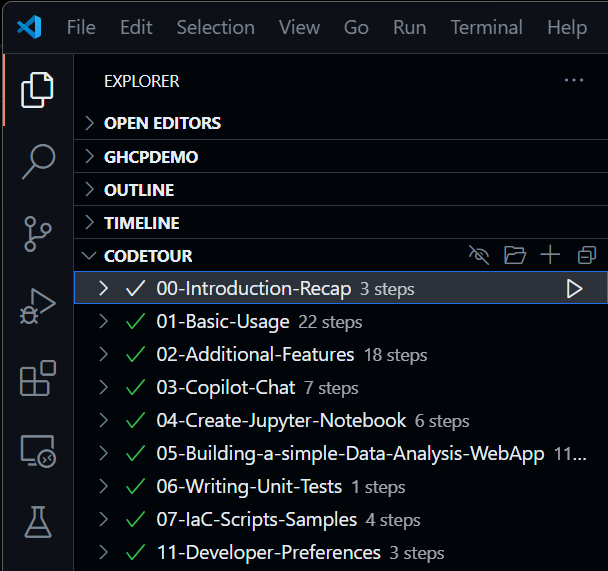
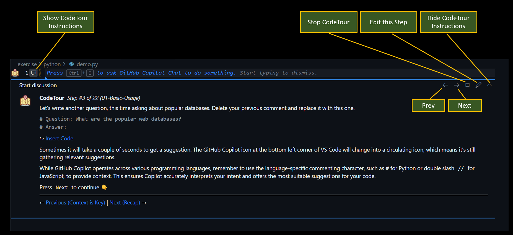
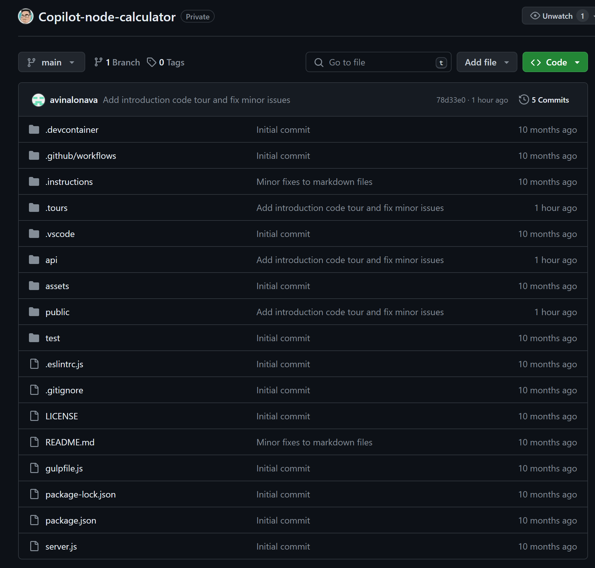

# GitHub Copilot Training

This repository is used for the GitHub Copilot Developer Training at Optus.

The repository contains code snippets that can be used to demonstrate the capabilities of GitHub Copilot.

The intended audience for this repo is for Trainers who are conducting the training session. This can also be shared with developers who are interested in learning more about GitHub Copilot.

## Pre-requisites

In order to follow along with the instructions provided in this repository, you will need to have the following installed on your machine:

- [Git](https://git-scm.com/downloads)
- [GitHub Copilot](https://copilot.github.com/)
- [CodeTour VS Extension](https://marketplace.visualstudio.com/items?itemName=vsls-contrib.codetour)
- [Python](https://www.python.org/downloads/) for Python code
- [Node.js](https://nodejs.org/en/download/) for JavaScript/TypeScript code

## Getting Started

In order to get started with GitHub Copilot, you will need to install the GitHub Copilot extension in your IDE. Once you have installed the extension, you can start using it to generate code snippets.

### CodeTour

This repository also contains CodeTour files that you can use to get a guided tour of the repository. To get started with CodeTour, you will need to install the CodeTour extension in your IDE.

Once CodeTour is installed, you will see a new CODETOUR section under the VS Code activity bar.

### Order of CodeTour

To get started, simply select on the CodeTour in the following order, click the first step and follow the instructions:

1. 00-Introduction-Recap
2. 01-Basic-Usage
3. 02-Additional-Features
4. 03-Copilot-Chat
5. 04-Create-Jupyter-Notebook
6. 05-Building-a-simple-Data-Analysis-WebApp
7. TBD
8. TBD
9. 08-Developer-Preferences

### CodeTour Navigation and Controls

### Unit Test Project

There is a different repository that contains the unit test project where we will continue to use GitHub Copilot to generate Unit Test code snippets. The repository can be found [here.](https://github.com/alvinvinalon/Copilot-node-calculator.git)

https://github.com/alvinvinalon/Copilot-node-calculator.git

TODO: Ranjith to download the zip and upload to GitLab for Optus developers to use.

