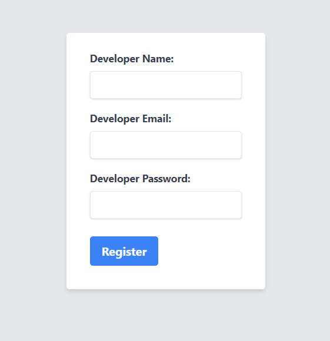

# Registration Form Exercise Instructions

This is an excercise to complete a simple developer registration form exercise using GitHub Copilot. The objective is to build a simple form featuring a registration form with client-side validation and corresponding unit tests.

## Prerequisites
- Basic understanding of HTML, CSS, and JavaScript
- Familiarity with Tailwind CSS for styling
- Experience with JavaScript testing frameworks (e.g., Jest)

## Time Required: 15 to 30 minutes

## Empty files provided

Empty files are provided where you can paste the code snippets generated by GitHub Copilot. Part of the exercise is to identify which file to paste the code into. Feel free to add other files as needed.

## Step 1: Create the HTML Structure for the Registration Form

**Prompt for GitHub Copilot:**
"Generate a simple HTML form structure with inputs for username, email, and password, and a submit button."

### If Public Code block is enabled, you may receive an message saying "Sorry, the response matched public code so it was blocked..."

A simple solution is to rephrase and change some of the names of the fields in your prompt. For example, you can change "username" to "developername" and "email" to "developeremail". This is just one way to work around the issue. Try to be creative and come up with your own ideas, and if successful, don't forget to share them with the community!

Revised prompt: "Generate a simple HTML scaffolding with a form structure and inputs for developername, developeremail, and developerpassword, and a register button."

## Step 2: Style the Form with Tailwind CSS

**Prompt for GitHub Copilot:**
"Provide Tailwind CSS classes for styling a form with rounded inputs and a prominent submit button. The form should be centered on the page with the appropriate padding and margin. Use labels for the input fields."

### If the response is incomplete...iterate

"Please generate the full HTML code with tailwind CSS requirement I have provided."

## Step 3: Implement Validation Functions in JavaScript

**Prompt for GitHub Copilot:**
"Write a JavaScript function to validate a username as alphanumeric with a length of 4 to 12 characters."

**Prompt for GitHub Copilot:**
"Write a JavaScript function to validate an email address using a standard email format."

**Prompt for GitHub Copilot:**
"Write a JavaScript function to validate a password with a minimum of 8 characters including both letters and numbers."

## Step 4: Integrate Validation Functions with the Form

**Prompt for GitHub Copilot:**
"How can I make a JavaScript function run to validate input fields on form submission?"

> Optional:
"The validation functions are in a separate file called validation.js. How do I reference that from index.html?"

**Ask where to add the code snippet:**
"Where do I need to add the JavaScript code to validate the form fields on submission?"

## Step 4.1: Display the values below in another page
**Prompt for GitHub Copilot: Few shots prompt**
"Generate a div element to display the following: Welcome, [username]! Your email is [email] and your password length is [password lenght]."

> Optional: 
"Let's hide the form when the validation is successful and display the div element with the user's information."

## Step 5: Generate Unit Tests for the Validation Functions

**Prompt for GitHub Copilot:**
> Make the validate.js tab active
"Write Jest test cases for the following functions: `validateUsername`, `validateEmail`, and `validatePassword`."

> Question for you: Where do you usually save the suggested tests generated by Copilot?

**Prompt for GitHub Copilot:**
"What do I need in order to run Jest tests for the form validation functions?"

## Step 6: Execute and Review

Run the tests to ensure all validations are working as expected. Review the form in a web browser, test its functionality, and resolve any issues that arise.

### Iterate and Improve

In case you get any errors, try to understand the issue and make the necessary changes to fix it. If you get stuck, use GitHub Copilot Chat to ask for help by pasting in the error message or code snippet into the Chat window.

---
