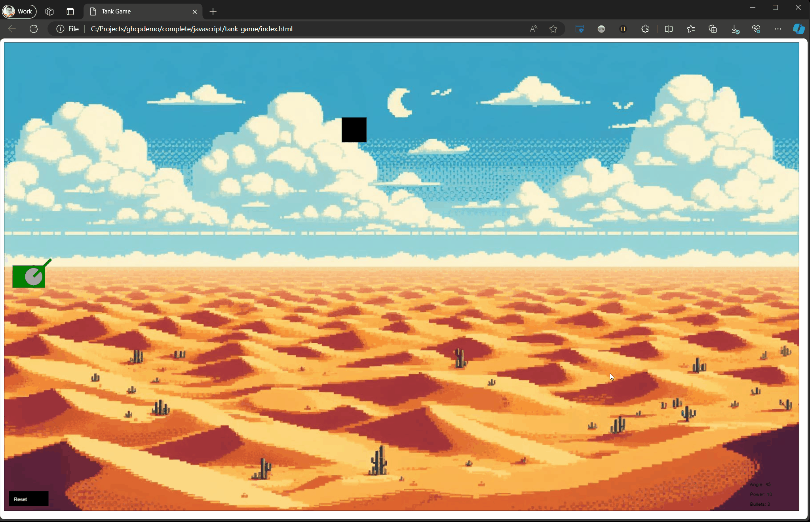

# Tank Game Challenge:

The goal of this challenge is to apply what you've learned with using GitHub Copilot chat. Your task is to come up with the right questions to ask Copilot to help you complete this basic JavaScript game based on an old game "Tanks".

## The Game 

## Objective of the game:
To play the game, the player must use the up/down keys to move the angle of the tank's cannon, left/right to adjust the power, and pressing space bar to shoot. The goal is to hit the black box (target) before the bullets run out (3 by default).

Bullet limit can be adjusted by changing the `bulletCount` property in the `tank` object, found in the `resetGame()` function. 

## Controls:
- `Up Arrow` - Move the tank cannon angle up.
- `Down Arrow` - Move the tank cannon angle down.
- `Left Arrow` - Decrease the tank's cannon power.
- `Right Arrow` - Increase the tank's cannon power.
- `Space Bar` - Shoot the bullet.

## Coding Challenge
Complete the following challenges using GitHub Copilot chat to fix or revise the tankgame.js JavaScript code.

The `tankgame.js` exercise file is found in the `exercise\javascript\tank-game` directory.

> Hint: Before asking Copilot, highlight the entire contents of the `tankgame.js` file. Then start writing you questions in the chat. 

> Remember: If you don't get the response you were expecting, try rephrasing the question or breaking it down into smaller questions. Iterate, iterate, iterate!

Here are you challenges:

1.) Add physics to the bullet trajectory with configurable air resistance and gravity. Currently, the bullet travels on a straight line. Adding physics to the bullet will make it more realistic and challenging to hit the target. (refer to GIF above.)

> This may sound complex, but it's actually really simple. You can start by asking Copilot how to add physics to the bullet trajectory. Then ask how to add air resistance and gravity to the bullet. 

2.) Change the fill color of the Tank rectangle to green. Then the circle fill with dark gray. Change the color of the bullet to red.

3.) Change the playable canvas area to use the entire browser window. When the window is resized, the canvas should resize accordingly.

4.) Add a background image to the canvas. Image is available at `exercise\javascript\tank-game\image\background.jpg`. 

5.) Add a function that detects if the bullet leaves the canvas area. Before displaying "You Lose", the bullet should be off the canvas.

## Developed using plain English

 The complete code of the game is under `completed/javascript/tank-game/tankgame.js` and was developed by asking GitHub Copilot Chat. Only the comments were added manually.

## Image by DALL-E 3
The backround image is created by OpenAI's DALL-E 3 model.